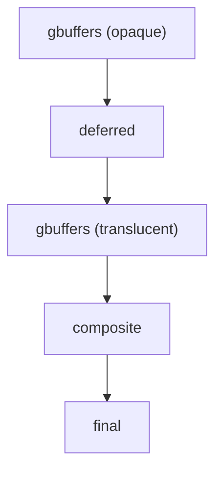

In this chapter, we'll jump right in on how Minecraft renders *things*. There's a lot of things Minecraft can render - blocks (the terrain), entities, the sky, clouds, water, etc...

All of them are rendered by different **programs**, known as **geometry buffers** (gbuffers).

Let's take this unassuming sheep, for example.


Let's go to the **entities g-buffer**. This g-buffer renders - you've guessed it, entities! It's contained in `gbuffers_entities.fsh` and `gbuffers_entities.vsh`.

Remember **fragment** and **vertex** shaders? `fsh` stands for **f**ragment **sh**ader, and `vsh` stands for **v**ertex **sh**ader. Let's mess around with the fragment one for now.

```diff lang="glsl"
#version 330 compatibility

uniform sampler2D lightmap;
uniform sampler2D gtexture;
uniform vec4 entityColor;

uniform float alphaTestRef = 0.1;

in vec2 lmcoord;
in vec2 texcoord;
in vec4 glcolor;

/* RENDERTARGETS: 0 */
layout(location = 0) out vec4 color;

void main() {
	color = texture(gtexture, texcoord) * glcolor;
	color.rgb = mix(color.rgb, entityColor.rgb, entityColor.a);
	color *= texture(lightmap, lmcoord);
+  color.r = 1.0;
	if (color.a < alphaTestRef) {
		discard;
	}
}
```

We're telling the shader to **always** set the red value of the sheep to be 100% (`1.0`). And, lo and behold...


Our sheep is indeed red! Let's go over the vertex shader as well.

```diff lang="glsl"
#version 330 compatibility

out vec2 lmcoord;
out vec2 texcoord;
out vec4 glcolor;

void main() {
	gl_Position = ftransform();
+  gl_Position.xy /= 2.0;
	texcoord = (gl_TextureMatrix[0] * gl_MultiTexCoord0).xy;
	lmcoord = (gl_TextureMatrix[1] * gl_MultiTexCoord1).xy;
	glcolor = gl_Color;
}
```

We're dividing the position of each vertex by half, making them go closer to the entity's origin.


...thus making the sheep small! And thus - each `.fsh` and `.vsh` file (or **program**) determines how a given layer is rendered. Usually, these programs are executed in this sequence:



All G-Buffers are processed at once, merged, then put into `composite`. Because of that, we usually apply shadows, reflections, etc. from `composite` - because each g-buffer runs independently of one another!

These programs are written in in **GLSL**. It works similar to C or C++ - with a few tweaks to make it specialized for shading! They run completely on the GPU, but are given data from Minecraft's game world via...

## Uniforms

A **uniform** is a variable that stays constant during the execution of `main`. It's given by the CPU to the GPU - so, it can contain stuff like entity textures and their colors! Let's look at what uniforms we're given in `gbuffers_entity.fsh`.

```glsl
uniform sampler2D gtexture; // the texture atlas for the entity
uniform vec4 entityColor; // a tint to apply to the entity. This is used for e.g. the color of sheep's wool!
```

Using uniforms, we can get information from the game world from the GPU. There are a LOT of uniforms we have on hand - click [here](https://shaders.properties/current/reference/uniforms/overview/) for a complete list.

## Texture atlases
Minecraft is smart about textures - instead of swapping out textures for thousands of different blocks in the world, it uses *just one*. This one big texture is called an **atlas** - basically, a couple of smaller textures in a trench coat! Go take a look:


So, when Minecraft wants to change the type of a block, it just needs to shift the coordinate *in* the texture. It's hella fast!

## Input/output variables

Vertex shaders can pass outputs to fragment shaders. In our vertex shader, we can do this:

```glsl
out vec2 lmcoord; // we define them here...
out vec2 texcoord;
out vec4 glcolor;

void main() {
	gl_Position = ftransform();

  // ...then assign to them here!
	texcoord = (gl_TextureMatrix[0] * gl_MultiTexCoord0).xy;
	lmcoord = (gl_TextureMatrix[1] * gl_MultiTexCoord1).xy;
	glcolor = gl_Color;
}
```

...and we can then reference these outputs in the fragment shader!

```glsl
in vec2 lmcoord;
in vec2 texcoord;
in vec4 glcolor;
```

This is pretty darn important, as light levels are encoded in the **vertices**. While we're talking about that...

## Light levels
Take a look at this torch:


Notice how the light levels decrease the further we go from the torch. Minecraft stores the light levels in the *vertices themselves!* In our template, we already are fetching light levels from the vertices to the `lmcoord` output. Let's open up `gbuffers_terrain.fsh` to take a look:

```diff lang="glsl"
#version 330 compatibility

uniform sampler2D lightmap;
uniform sampler2D gtexture;

uniform float alphaTestRef = 0.1;

in vec2 lmcoord;
in vec2 texcoord;
in vec4 glcolor;

/* RENDERTARGETS: 0 */
layout(location = 0) out vec4 color;

void main() {
-	color = texture(gtexture, texcoord) * glcolor;
-  color *= texture(lightmap, lmcoord);
+  color = vec4(lmcoord.x, 0, 0, 1);
	if (color.a < alphaTestRef) {
		discard;
	}
}
```

...reload, and take a look:


So - `lmcoord` is a vector that gives us the light levels. We have the light level emitted by blocks (torches, furnaces, etc...) in X, and the sky light level (decreases when we are e.g. in a cave) in Y.

An important note is that `lmcoord` is in the range of `[0.033, 0.97]`, which isn't too useful - you can use this formula to make the range a more sane `[0.0, 1.0]`:

```glsl
lmcoord = lmcoord / (30.0 / 32.0) - (1.0 / 32.0);
```

## Render targets

We use render targets to transfer data between passes - mainly from `gbuffers` to `composite` and `final`.

We have **10 different buffers** at our disposal, indexed 0 through 9. Each buffer stores 4 values for each pixel - RGBA, XYZW, whatever! We define what we'll be writing to with `RENDERTARGETS`:

```
/* RENDERTARGETS: 0 */
```

This specifies to *which* textures we will be rendering to. This is _really_ useful when we'll be doing deferred rendering in the next chapter.

The first (index `0`) render target is _usually_ used for the color of the texture. For example - we could write to buffer #0 in `gbuffers_terrain.fsh`:

```glsl
/* RENDERTARGETS: 0 */
layout(location = 0) out vec4 color;

void main() {
	color = texture(gtexture, texcoord) * glcolor;
}
```

...and then read that from `composite.fsh`:

```glsl
#version 330 compatibility

uniform sampler2D colortex0; // the g-buffers wrote to this!

in vec2 texcoord;

/* RENDERTARGETS: 0 */
layout(location = 0) out vec4 color;

void main() {
	color = texture(colortex0, texcoord); // in our case, we just return what we had in the buffer #0.
}
```

It is important to remember that for `layout(location = N)`, `N` refers to the `RENDERTARGETS` directive. So, if we were to define `/* RENDERTARGETS:6,7 */`, then we'd write:

```glsl
layout(location = 0) out vec4 myFancyData; // writes to colortex6
layout(location = 1) out vec4 someOtherFancyVector; // writes to colortex7
```

All numbers in render targets also **must** be between `0.0` and `1.0`, unless we explicitly change that (and affect performance). It's also recommended to always set the 4th component (the alpha) to `1.0`, so that the GPU doesn't mistakenly do any blending or skip writing.
